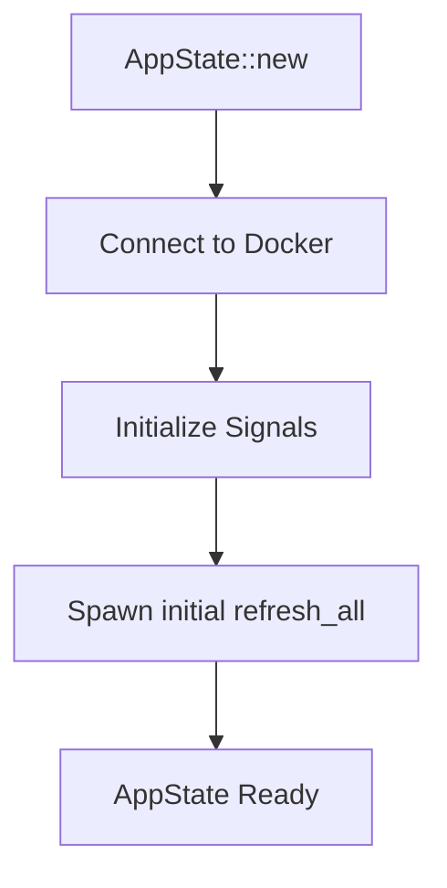
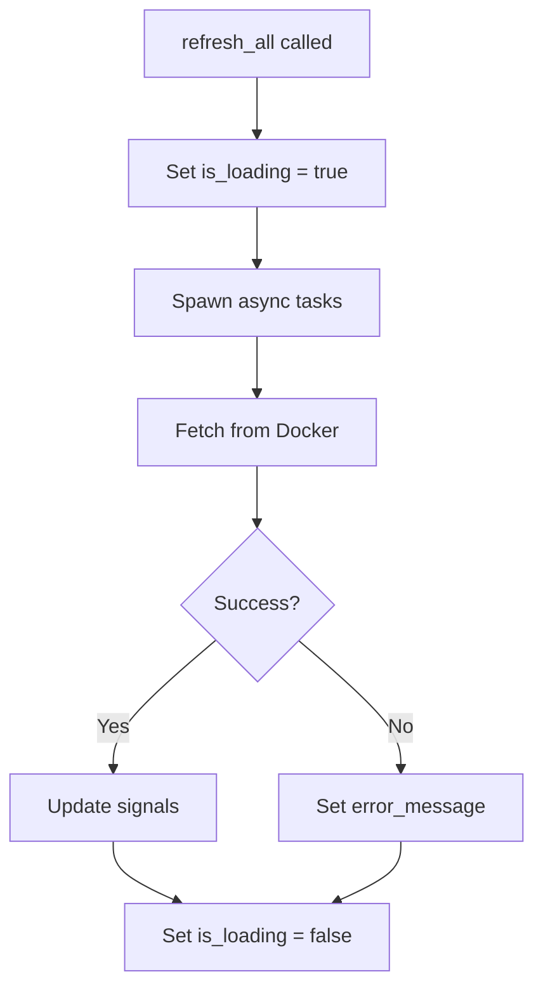
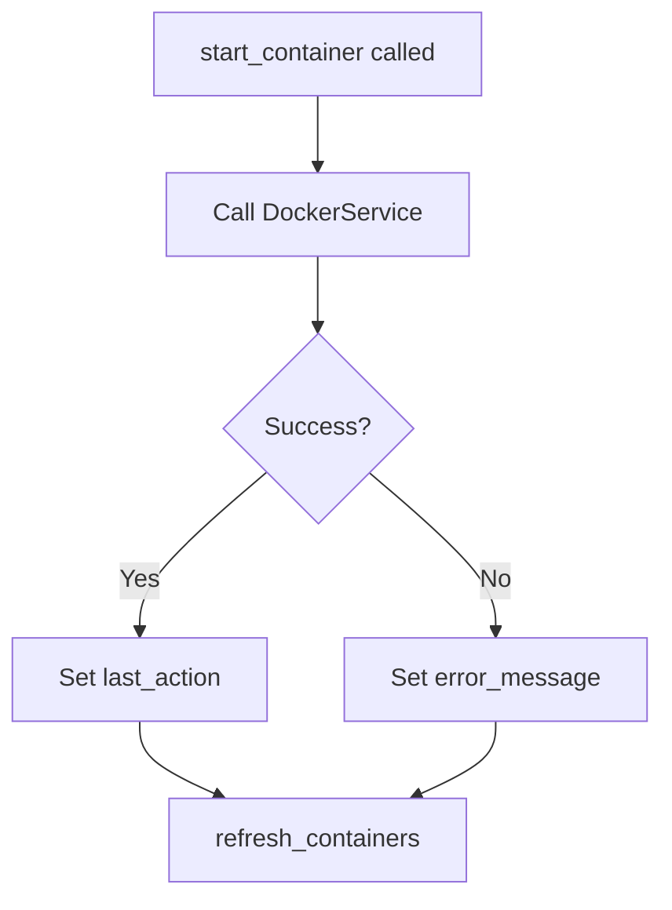

# Application State API Reference

Complete API reference for the application state management.

## Module: `utils::app_state`

**Location**: `src/utils/app_state.rs`

### Overview

AppState provides centralized, reactive state management using Dioxus signals. It's shared throughout the component tree via the Context API.

## AppState Structure

```rust
#[derive(Clone)]
pub struct AppState {
    pub docker_host: Signal<String>,
    pub containers: Signal<Vec<ContainerInfo>>,
    pub images: Signal<Vec<ImageInfo>>,
    pub volumes: Signal<Vec<VolumeInfo>>,
    pub last_action: Signal<Option<String>>,
    pub error_message: Signal<Option<String>>,
    pub is_loading: Signal<bool>,
    docker_service: Option<DockerService>,
}
```

## Fields

### `docker_host: Signal<String>`

Docker connection endpoint.

**Default**: `unix:///var/run/docker.sock` or `$DOCKER_HOST`

**Example**:
```rust
let host = (app_state.docker_host)();
println!("Connected to: {}", host);
```

---

### `containers: Signal<Vec<ContainerInfo>>`

List of all Docker containers.

**Updated by**: `refresh_containers()`, `refresh_all()`

**Example**:
```rust
let containers = (app_state.containers)();
let running = containers.iter()
    .filter(|c| c.state == ContainerState::Running)
    .count();
```

---

### `images: Signal<Vec<ImageInfo>>`

List of all Docker images.

**Updated by**: `refresh_images()`, `refresh_all()`

**Example**:
```rust
let images = (app_state.images)();
let total_size: i64 = images.iter()
    .map(|i| parse_size(&i.size))
    .sum();
```

---

### `volumes: Signal<Vec<VolumeInfo>>`

List of all Docker volumes.

**Updated by**: `refresh_volumes()`, `refresh_all()`

**Example**:
```rust
let volumes = (app_state.volumes)();
println!("Total volumes: {}", volumes.len());
```

---

### `last_action: Signal<Option<String>>`

Last successful action message.

**Usage**: Display success notifications to users.

**Example**:
```rust
let last = (app_state.last_action)();
if let Some(action) = last {
    println!("✓ {}", action);
}
```

---

### `error_message: Signal<Option<String>>`

Current error message (if any).

**Usage**: Display error notifications to users.

**Example**:
```rust
let error = (app_state.error_message)();
if let Some(msg) = error {
    rsx! {
        div { class: "error", "⚠️ {msg}" }
    }
}
```

---

### `is_loading: Signal<bool>`

Loading state indicator.

**Usage**: Show loading spinners, disable buttons.

**Example**:
```rust
let loading = (app_state.is_loading)();
rsx! {
    button {
        disabled: loading,
        "Refresh {loading ? '...' : ''}"
    }
}
```

## Methods

### `new() -> Self`

Creates a new AppState instance.

**Behavior**:
1. Connects to Docker daemon
2. Initializes all signals
3. Spawns initial data load

**Returns**: `AppState` instance

**Example**:
```rust
fn main() {
    dioxus::launch(App);
}

#[component]
fn App() -> Element {
    let app_state = AppState::new();
    use_context_provider(|| app_state);
    
    rsx! { Router::<Route> {} }
}
```

---

### `refresh_all(&self)`

Refreshes all Docker data (containers, images, volumes).

**Async**: Spawns background task

**Updates**:
- `is_loading` → `true` during operation
- `containers`, `images`, `volumes` with new data
- `error_message` if operation fails
- `is_loading` → `false` when complete

**Example**:
```rust
rsx! {
    button {
        onclick: move |_| app_state.refresh_all(),
        "Refresh All"
    }
}
```

---

### `refresh_containers(&self)`

Refreshes only container data.

**Async**: Spawns background task

**Updates**:
- `is_loading` → `true`
- `containers` with new data
- `error_message` on failure
- `is_loading` → `false`

**Example**:
```rust
rsx! {
    button {
        onclick: move |_| app_state.refresh_containers(),
        "Refresh Containers"
    }
}
```

---

### `refresh_images(&self)`

Refreshes only image data.

**Async**: Spawns background task

**Example**:
```rust
app_state.refresh_images();
```

---

### `refresh_volumes(&self)`

Refreshes only volume data.

**Async**: Spawns background task

**Example**:
```rust
app_state.refresh_volumes();
```

---

### `start_container(&self, id: String)`

Starts a stopped container.

**Parameters**:
- `id`: Container ID or name

**Async**: Spawns background task

**Updates**:
- `last_action` on success
- `error_message` on failure
- Calls `refresh_containers()` after operation

**Example**:
```rust
rsx! {
    button {
        onclick: move |_| {
            app_state.start_container(container.id.clone())
        },
        "Start"
    }
}
```

---

### `stop_container(&self, id: String)`

Stops a running container.

**Parameters**:
- `id`: Container ID or name

**Async**: Spawns background task

**Updates**:
- `last_action` on success
- `error_message` on failure
- Calls `refresh_containers()` after operation

**Example**:
```rust
rsx! {
    button {
        onclick: move |_| {
            app_state.stop_container(container.id.clone())
        },
        "Stop"
    }
}
```

## Usage Patterns

### Providing AppState

In your root component:

```rust
#[component]
fn App() -> Element {
    // Create and provide AppState
    let app_state = AppState::new();
    use_context_provider(|| app_state);
    
    rsx! {
        // Your app content
        Router::<Route> {}
    }
}
```

### Consuming AppState

In any child component:

```rust
#[component]
fn MyComponent() -> Element {
    // Get AppState from context
    let app_state = use_context::<AppState>();
    
    // Read signals by calling them
    let containers = (app_state.containers)();
    
    rsx! {
        div { "Total: {containers.len()}" }
    }
}
```

### Reading State

```rust
// Single read
let containers = (app_state.containers)();

// Multiple reads
let containers = (app_state.containers)();
let images = (app_state.images)();
let volumes = (app_state.volumes)();
```

### Updating State

Don't write directly to state signals. Use AppState methods:

```rust
// ✅ Good: Use methods
app_state.refresh_containers();
app_state.start_container(id);

// ❌ Bad: Direct write
*app_state.containers.write() = new_containers;
```

### Derived State

Compute values from state:

```rust
#[component]
fn Dashboard() -> Element {
    let app_state = use_context::<AppState>();
    let containers = (app_state.containers)();
    
    // Compute derived values
    let running = containers.iter()
        .filter(|c| c.state == ContainerState::Running)
        .count();
    let stopped = containers.len() - running;
    
    rsx! {
        div { "Running: {running}, Stopped: {stopped}" }
    }
}
```

For expensive computations, use memos:

```rust
let running_count = use_memo(move || {
    (app_state.containers)()
        .iter()
        .filter(|c| c.state == ContainerState::Running)
        .count()
});
```

### Error Handling

```rust
#[component]
fn ErrorDisplay() -> Element {
    let app_state = use_context::<AppState>();
    let error = (app_state.error_message)();
    
    rsx! {
        if let Some(msg) = error {
            div { class: "error-banner",
                "⚠️ {msg}"
                button {
                    onclick: move |_| {
                        *app_state.error_message.write() = None;
                    },
                    "Dismiss"
                }
            }
        }
    }
}
```

### Loading States

```rust
#[component]
fn LoadingButton() -> Element {
    let app_state = use_context::<AppState>();
    let is_loading = (app_state.is_loading)();
    
    rsx! {
        button {
            disabled: is_loading,
            onclick: move |_| app_state.refresh_all(),
            if is_loading {
                "Loading..."
            } else {
                "Refresh"
            }
        }
    }
}
```

## State Lifecycle

### Initialization



1. `AppState::new()` called
2. Connects to Docker daemon
3. Initializes all signals with empty/default values
4. Spawns `refresh_all()` to load initial data
5. Returns AppState instance

### Refresh Cycle



### Container Operation



## Thread Safety

AppState and its signals are:
- **Clone**: Can be cloned for use in async tasks
- **Send**: Can be sent between threads
- **Sync**: Can be shared between threads

This allows safe use in async operations:

```rust
spawn(async move {
    // Clone signals for use in async block
    let containers = app_state.containers;
    let error = app_state.error_message;
    
    // Safely update from async context
    match fetch_data().await {
        Ok(data) => *containers.write() = data,
        Err(e) => *error.write() = Some(e.to_string()),
    }
});
```

## Best Practices

### 1. Use Methods Over Direct Writes

```rust
// ✅ Good
app_state.refresh_containers();

// ❌ Bad
*app_state.containers.write() = new_data;
```

### 2. Clear Errors Before Operations

```rust
pub fn retry_operation(&self) {
    *self.error_message.write() = None;
    self.refresh_all();
}
```

### 3. Provide Feedback

```rust
// Show loading state
*self.is_loading.write() = true;

// Show success
*self.last_action.write() = Some("Container started".to_string());

// Show errors
*self.error_message.write() = Some("Operation failed".to_string());
```

### 4. Handle Missing Docker Service

```rust
match &self.docker_service {
    Some(service) => {
        // Use service
    }
    None => {
        *self.error_message.write() = Some(
            "Docker service not available".to_string()
        );
    }
}
```

## Testing

```rust
#[cfg(test)]
mod tests {
    use super::*;
    
    #[test]
    fn test_app_state_initialization() {
        let state = AppState::new();
        
        // Verify initial values
        assert!(state.containers().is_empty());
        assert!(state.error_message().is_none());
        assert!(!state.is_loading());
    }
}
```

## Related Documentation

- [State Management Architecture](../architecture/state-management.md)
- [Component Structure](../architecture/components.md)
- [Docker Service API](docker-service.md)
